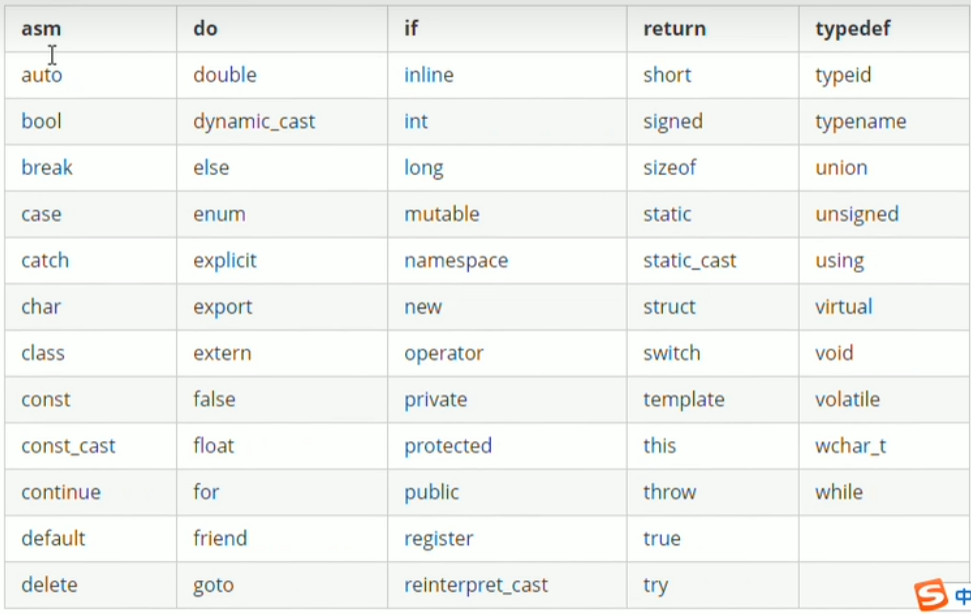
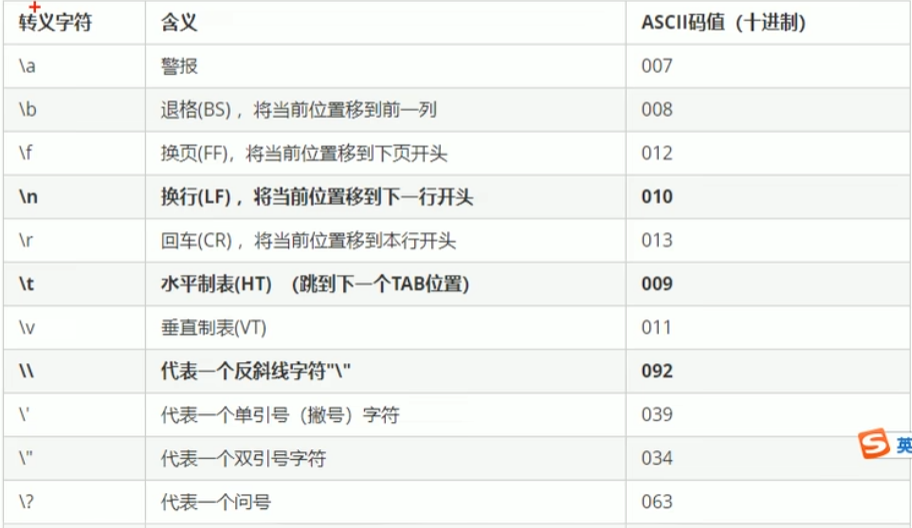
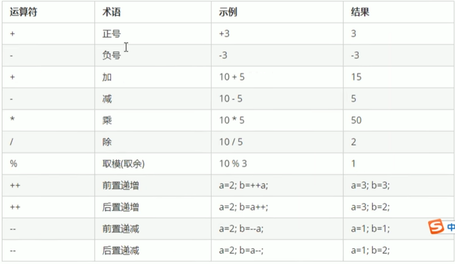
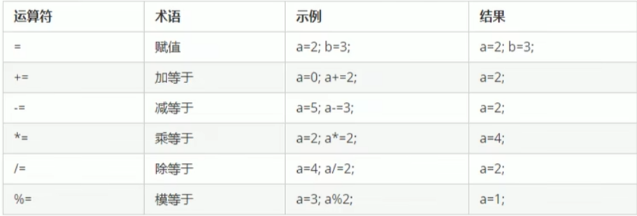
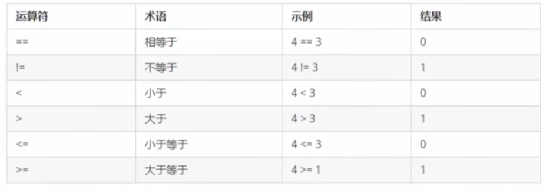
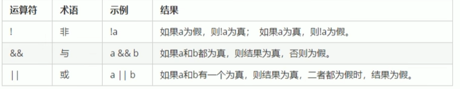

# C++基础

## 1 基本语法

### 1.1第一个c++程序

输入输出：cout, cin

包含头文件：#include<iostream>

```c++
using namespace std;
cout<< "hello world" << endl;
```

### 1.2注释

单行注释：

```c++
//单行注释内容
```

多行注释：

```c++
/* 多行注释内容
多行注释内容 */
```

### 1.3变量

作用：给一段指定的内存空间起名，方便操作这一段内存；

语法：`数据类型 变量名 = 初始值`；

code:

```c++
int a = 10;
cout << "a = " << a <<endl;
```

### 1.4常量

作用：用于记录程序中不可更改的数据；

C++定义常量的两种方式：

1. #define 宏常量：`define 常量名 常量值`
   - 通常在文件上方定义，表示一个常量
2. const修饰的变量：`const 数据类型 常量名 = 常量值`
   - 通常在变量定义前加关键词const，修饰该变量为常量，不可修改

code:

```c++
//1.宏变量
#define day 7

const int month = 12;
```

### 1.5关键字（标识符）

**作用**：c++预先保留的单词（标识符）

**在定义变量或者常量时，不要用关键字**

c++关键字：



### 1.6标识符命名规则

作用：C++规定给标识符（常量、变量）命名时，有一套自己的规则

- 标识符不能是关键字
- 标识符只能由字母、数字、下划线组成
- 第一个字符必须为字母或者下划线
- 标识符的字母区分大小写

## 2 数据类型

C++规定在创建一个变量或者常量时，必须要指出相应的数据类型，否则无法给变量分配内存

### 2.1 整型

作用：整型变量表示的是整数类型的数据

C++能表示的整型有以下几种方式：区别在于所占的内存空间不同：

| 数据类型            | 占用空间                                        | 取值范围         |
| ------------------- | ----------------------------------------------- | ---------------- |
| short(短整型)       | 2字节                                           | (-2^15 ~ 2^15-1) |
| int(整型)           | 4字节                                           | (-2^31 ~ 2^31-1) |
| long(长整型)        | windows为4字节，Linux(32位)为4字节，8字节(64位) | (-2^31 ~ 2^31-1) |
| long long(长长整型) | 8字节                                           | (-2^63 ~ 2^63-1) |

### 2.2 sizeof 关键字

作用：利用sizeof关键字统计数据类型所占的内存大小

语法：`sizeof(数据类型/变量)`

code：

```c++
cout << "short类型所占的内存空间为" << sizeof(short) << endl;
int num = 10;
cout << "num所占的内存空间为" << sizeof(num) << endl;
```

整型结论：==short < int <= long <= long long==

### 2.3 实数（浮点型）

作用：用于表示小数

分为两种：1、单精度float；2、双精度double

两种的区别在于表示的有效数字范围不同。

- 注：3.14有3位有效数字

| 数据类型 | 占用空间 | 有效数字范围    |
| -------- | -------- | --------------- |
| float    | 4字节    | 7位有效数字     |
| double   | 8字节    | 15~16位有效数字 |

code：

```c++
float f1 = 3.1415926f;
//加上f默认为float，否则默认为double类型
double d1 = 3.1415926;
//默认输出小数只显示6位有效数字，因此这里输出没有差别
cout << "f1 = " << f1 << endl;
cout << "d1 = " << d1 << endl;
```

### 2.4 字符型

作用：用于显示单个字符

语法：`char ch = ’a‘;`

> 注意1：使用单引号；
>
> 注意2：只能有一个字符，不能是字符串；

- c和c++中字符型变量占用==1个字节==
- 字符型变量并不是把字符本身放入内存中存储，而是将对应的ASCII编码放入到存储单元

code：

```c++
char ch = 'a';
//a对应的Ascii码：97  A：65
cout << int(ch) << endl;
cout << sizeof(char) << endl;
ch = 98;//可以直接赋值ASCII码值
```

### 2.5 转义字符

作用：用于表示一些不能显示出来的ASCII字符



### 2.6 字符串型

作用：用于表示一串字符

两种风格

1. C风格字符串：`char 变量名[] = "字符串值"`

   code：

   ```c++
   char str1[] = "hello world";
   cout << sizeof(str1) << endl;
   ```

   > 输出：12

   > 注意：C风格字符串要用双引号括起来

2. C++风格字符串：`string 变量名 = "字符串值"`

   code:

   ```c++
   string str2 = "hello world";
   cout << sizeof(str2) << endl;
   ```

   > 输出：28
   >
   > 注意：需要包含头文件`#include<string>`

### 2.7 布尔类型bool

作用：表示真或者假的值

bool类型只有两种：true --- 真（1/非0）；false --- 假（0）；占用**1个字节**

### 2.8 数据的输入

关键字：cin

语法：`cin >> 变量`

## 3 运算符

作用：用于执行代码的运算

| 运算符类型 | 作用                                   |
| ---------- | -------------------------------------- |
| 算术运算符 | 用于处理四则运算                       |
| 赋值运算符 | 用于将表达式的值赋给变量               |
| 比较运算符 | 用于表达式的比较，返回一个真值或者假值 |
| 逻辑运算符 | 用于根据表达式的值返回真值或者假值     |

### 3.1 算术运算符

有以下符号：



> 注意1：除法/ 两个整数相除会得到一个整数，将小数部分去除了
>
> 注意2：除数不能为零，在代码中应当避免

前置递增：先让变量+1，然后进行表达式运算；

后置递增：先进行表达式的运算，后让变量+1；

code:

```c++
	int a = 10;
	int b;
//	b = ++a * 2;//先++a 然后b = 11 * 2
	b = a++ * 2;//先乘法b = 10*2,然后变量a++ 
	cout << a << endl;
	cout << b << endl;
```

> 输出：11 20
>
> //输出：11 22

### 3.2 赋值运算符

作用：用于将表达式的值赋给变量

有以下：



### 3.3 比较运算符

作用：用于表达式的比较，返回一个真值或假值



### 3.4 逻辑运算符

作用：用于根据表达式的值返回真值或者假值



## 4 程序流程结构

c/c++支持的最基本的三种程序运行结构：**顺序结构，选择结构和循环结构**

### 4.1选择结构

#### 4.1.1 if语句

- 单行格式if语句
- 多行格式if语句
- 多条件的if语句

1. 单行格式的if语句：`if(条件){满足条件的语句}`
2. 多行格式的if语句：`if(条件){满足条件的语句} else {不满足条件的语句}`
3. 多条件的if语句：`if(条件1){满足条件1的语句} else if(条件2) {满足条件2的语句}...else {所有条件都不满足的语句}`

#### 4.1.2 三目运算符

作用：通过三目运算符实现简单的判断

语法：`表达式1 ? 表达式2 ：表达式3 `

解释：

如果表达式1的值为真，执行表达式2，并返回表达式2的结果；

如果表达式1的值为假，执行表达式3，并返回表达式3的结果；

返回的是变量，可以进行赋值操作：`(a > b ? a:b) = 100`

#### 4.1.3 switch语句

作用：执行多条件分支语句

语法：

```c++
switch(表达式)
{
	case 结果1: 执行语句；break;
	case 结果2: 执行语句；break;
    ...
    default: 执行语句;break;
}
```

若没有break，会将后面的分支都执行一遍。

if 和switch的区别：

switch判断表达式条件时只能是字符型和整型，不可以是一个区间；

switch结构清晰，执行效率高。

### 4.2 循环结构

#### 4.2.1 while循环语句

语法：`while(循环条件) {循环语句}`

解释：只要条件为真，就执行循环语句。

可以用**break**退出当前循环。

code：

```c++
//随机数种子
srand((unsigned int)time(NULL));
int num = rand()%100+1; //1-100
int val;
while (1)
{
    cin >> val;
    if (val > num)
        cout << "大了" << endl;
    else if (val < num)
        cout << "小了" << endl;
    else
    {
        cout << "猜对了" << endl;
        break;
    }
}
```

#### 4.2.2 do...while循环语句

语法：`do{循环语句} while(循环条件);`

注意：与while不同的是，do...while会先执行一次循环语句，再判断条件。

code：

```c++
int num = 100;
int a, b, c;
do
{
    a = num / 100;
    b = num / 10 % 10;
    c = num % 10;
    if ((a*a*a + b*b*b + c*c*c) == num)
        cout <<"水仙花数："<< num << endl;
    num++;
} while (num < 1000);
```

#### 4.2.3 for循环语句

语法：`for(起始表达式; 条件表达式; 末尾循环体){循环语句;}`

> 起始表达式只执行一次，末尾循环体在执行完循环语句后再执行一遍；

#### 4.2.4 嵌套循环

```c++
//乘法口诀表
for (int j = 1; j < 10; j++)
{
	for (int i = 1; i < j+1; i++)
	{
		cout << j << " * " << i << " = " << j * i << "  ";
	}
	cout << endl;
}
```

### 4.3 跳转语句

#### 4.3.1 break语句

作用：用于跳出选择结构或者循环结构

break使用的时机：

- 出现在switch条件语句中，作用是终止case，并跳出switch
- 出现在循环语句中，作用是跳出当前一层的循环语句

#### 4.3.2 continue语句

作用：在循环语句中，跳过本次循环余下尚未执行的语句，继续执行下一次循环

> break会退出循环，continue不会

#### 4.3.3 goto语句

作用：无条件跳转语句

语法：`goto 标记;`

标记定义：`标记:`

解释：标记名称存在，则跳转到标记的位置

> goto容易导致代码结构混乱，不建议使用

## 5 数组

### 5.1 概述

数组就是一个集合，里面存放了相同类型的数据元素

特点1：每个数据元素都是相同的数据类型

特点2：数组是由连续的内存位置组成的

### 5.2 一维数组

#### 5.2.1 一维数组的定义方式

1. `数据类型 数组名[数组长度];`
2. `数据类型 数组名[数组长度] = {值1， 值2...};`
3. `数据类型 数组名[] = {值1，值2...}；`

数组的索引从0开始；

第二种数组定义方法，若没有给出所有值，则会以0代替；

从以上可以看出，数组定义时必须直接或间接给定长度；

#### 5.2.2 一维数组数组名

用法：

1. 可以统计整个数组在内存中的长度
2. 可以获取数组在内存中的首地址

> 数组名是一个常量，不能赋值

code：

```c++
int arr[5] = { 1,2,3,4,5 };
cout << "数组中元素个数为：" << sizeof(arr) / sizeof(arr[0]) << endl;
cout << "数组首地址为：" << arr << endl;
cout << "第一个元素的地址为：" << &arr[0] << endl;//与上面一样
```

#### 5.2.3 冒泡排序

作用：最常用的排序算法

1. 比较相邻元素，如果第一个比第二个大，就交换位置
2. 对每一对相邻元素做相同工作，执行完毕后，找到第一个最大值
3. 重复上述步骤，每次比较次数-1，直到不需要比较

code:

```c++
int arr[] = { 4,2,8,0,5,7,1,3,9 };
int temp = 0;
int count = sizeof(arr) / sizeof(arr[0]);
cout << "排序前数组为：";
for (int i = 0; i < count - 1; i++)
    cout << arr[i] << " ";
cout << endl;
//总共排序轮数为 元素个数-1
for (int j = 0; j < count - 1; j++)
{
    //每次排序对比次数为 元素个数-1-当前轮数
    for (int i = 0; i < count -1 -j; i++)
        if (arr[i] > arr[i + 1])
        {
            temp = arr[i];
            arr[i] = arr[i + 1];
            arr[i + 1] = temp;
        }
}
cout << "排序后数组为：";
for (int i = 0; i < count - 1; i++)
    cout << arr[i] << " ";
cout << endl;
```

### 5.3 二维数组

#### 5.3.1二维数组的定义方式

1. `数据类型 数组名[行数][列数];`
2. `数据类型 数组名[行数][列数] = {{值1， 值2}，{值3， 值4}};`
3. `数据类型 数组名[行数][列数] = {值1，值2，值3，值4}；`
4. `数据类型 数组名[][列数] = {值1，值2，值3，值4}；`

> 建议：以上4种，第二种更加直观，提高可读性
>
> 注意：第四种可以省略行数，但列数不可以省略

#### 5.3.2 二维数组的名称

作用：

1. 可以统计整个数组在内存中的长度
2. 可以获取数组在内存中的首地址

code：

```c++
int arr[2][3] = 
{
    {1,2,3},
    {4,5,6}
};
cout << "二维数组占用内存空间为：" << sizeof(arr) << endl;
cout << "二维数组第一行占用内存为：" << sizeof(arr[0]) << endl;
cout << "二维数组第一个元素占用内存为：" << sizeof(arr[0][0]) << endl;

cout << "二维数组行数为：" << sizeof(arr) / sizeof(arr[0]) << endl;
cout << "二维数组列数为：" << sizeof(arr[0]) / sizeof(arr[0][0]) << endl;
//以下一致
cout << "二维数组的首地址为：" << arr << endl;
cout << "二维数组第一行的首地址：" << arr[0]<< endl;
cout << "二维数组第一个元素的首地址：" << &arr[0][0] << endl;
```

## 6 函数

### 6.1 概述

作用：将一段经常使用的代码封装，减少重复代码

### 6.2 函数的定义

语法：

```
返回值类型 函数名（参数列表）
{
	函数体语句
	
	return 表达式
}
```

### 6.3 函数的调用

语法：`函数名（参数）`

参数传递：实参传递给形参

- 值传递：实参将数值传入给形参，形参改变时不会影响实参

### 6.4 函数的声明

作用：告诉编译器函数名称以及如何调用函数，函数的主体可以单独定义。

在主函数之前声明，才能被主函数调用。

> 函数的声明可以多次，但是定义只能一次

### 6.5 函数的分文件编写

4个步骤：

1. 创建.h头文件
2. 创建.cpp源文件
3. 头文件中写函数的声明
4. 源文件写函数的定义，并包含头文件

调用时包含该头文件即可

## 7 指针

### 7.1 指针的基本概念

作用：通过指针间接访问内存

- 内存编号从0开始，一般以十六进制数字表示
- 可以用指针变量保存地址

### 7.2 指针的定义与使用

语法：`数据类型 *指针名 = &变量名;`

使用方法：通过解引用的方法找到指针所指向的内存：*p

指针所占的内存空间：

不管什么类型的指针，在**32位操作系统下，占用4个字节**，**64位操作系统下占用8个字节**

### 7.3 空指针和野指针

**空指针**：指针变量指向内存中编号为0的空间

语法：`int *p = NULL`

用途：用于初始化指针变量

> 注意：空指针指向的内存是不可以访问的，0~255为系统占用内存，不允许用户访问
>
> 错误示例：int *p = NULL；  *p = 100;

**野指针**：指针变量指向非法的内存空间

例如：`int *p = (int *)0x1100`

> 未申请内存空间而直接进行指向的指针，应避免

### 7.4 const修饰指针

const修饰指针有三种情况：

1. const 修饰指针 --- 常量指针
2. const 修饰常量 --- 指针常量
3. const 既修饰指针，又修饰常量

常量指针

- 特点：指针的**指向(p)可以修改**，但指针指向的值(*p)不可以修改
- 语法：`const int* p  = &a;`
- 正确使用：`p = &b`
- 错误使用：`*p = 20`

指针常量

- 特点：指针**指向(p)不可以修改**，但指针指向的值(*p)可以修改
- 语法：`int* const p  = &a;`

const既修饰指针又修饰常量

- 语法：`const int* const p  = &a;`

> 技巧：看const右侧紧跟着的是指针还是常量，是指针就是常量指针，是常量就是指针常量

### 7.5 指针和数组

作用：通过指针访问数组

注意指针的类型决定了指针+1后偏移几个字节，如int类型指针，加一后p增加4

code :

```c++
int a[5] = {1,2,3,4,5};
int* p  = a;
cout <<"第一个元素：" << *p << endl;
p++;//指针类型决定了p++偏移几个字节 int 4 double 8
cout << "第二元素：" << *p << endl;
```

### 7.6 指针和函数

作用：指针作为函数参数，可以修改实参的值

```c++
//声明
void swap(int* pa,int* pb)
//使用
swap(&a,&b);
```

> 值传递不能修改实参，地址传递能修改实参

### 7.7 指针、数组和函数-冒泡排序

code:

```c++
void bubbleSort(int *p,int len)
{
    int temp;
    for (int j = 0; j < len - 1; j++)
    {
        //每次排序对比次数为 元素个数-1-当前轮数
        for (int i = 0; i < len - 1 - j; i++)
            if (p[i] > p[i+1])//*(p+i) = p[i]
            {
                temp = p[i];
                p[i] = p[i + 1];
                p[i + 1] = temp;
            }
    }
}
void printArr(int *arr,int len)//也可以是：arr[]
{
    for (int i = 0; i < len - 1; i++)
        cout << arr[i] << " ";
    cout << endl;
}
int main()
{
    int arr[10] = { 4,2,8,0,5,7,1,3,9,6 };
    int len = sizeof(arr) / sizeof(arr[0]);
    bubbleSort(arr,len);
    printArr(arr,len);
	system("pause");
	return 0;
}
```

## 8 结构体

### 8.1 结构体的基本概念

用于用户自定义数据类型，允许用户存储不同的数据类型

### 8.2 结构体的定义和使用

定义语法：`struct 结构体名 {结构体成员列表}；`

通过结构体创建变量：

- struct 结构体名 变量名；  （struct 可以省略）
- struct 结构体名 变量名 = {成员1，成员2};   （struct 可以省略）
- 定义结构体时，顺便创建变量

code：

```c++
struct Student
{
    string name;
    int    age;
    double score;
};
Student student;
student.name = "heping";
student.age = 24;
student.score = 91.1;
```

### 8.3 结构体数组

作用：将结构体放入数组

语法：`struct 结构体名 数组名[元素个数] = {{},{}...};`

code:

```c++
Student student[5];
student[0].name = "heping";
student[0].age = 18;
student[0].score = 1.1;
cout << student[0].name << endl;
```

### 8.4 结构体指针

作用：通过指针访问结构体中的成员

- 利用操作符`->`可以通过指针访问结构体成员

```c++
Student student;
Student* p = &student;
student.name = "heping";
student.age = 18;
student.score = 1.1;
cout << p->name << endl;
```

### 8.5 结构体嵌套结构体

作用：结构体的成员是结构体

### 8.6 结构体作为函数参数

- 值传递
- 地址传递

### 8.7 结构体中const使用场景

作用：使用const来防止误操作

通常值传递时数据量大的话，会造成很大的内存浪费，因此使用地址传递，保证只有一份数据。但为了不修改原始数据，传入指针参数时使用const修饰（常量指针，不允许修改指针指向的值）。

```c++
void printStudent(const student *stu)
```

### 8.8 结构体案例

通讯录管理系统增删查改

