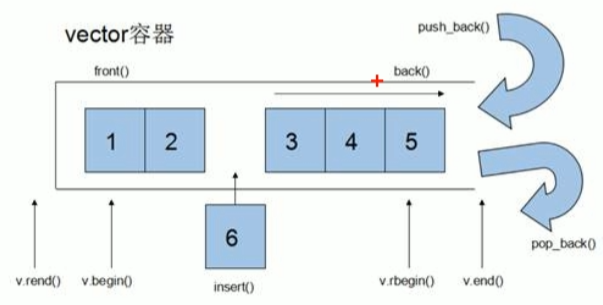
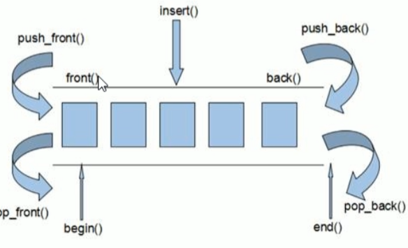
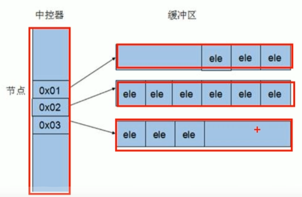
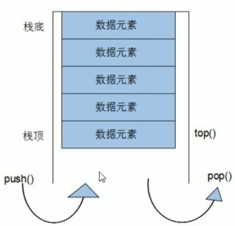
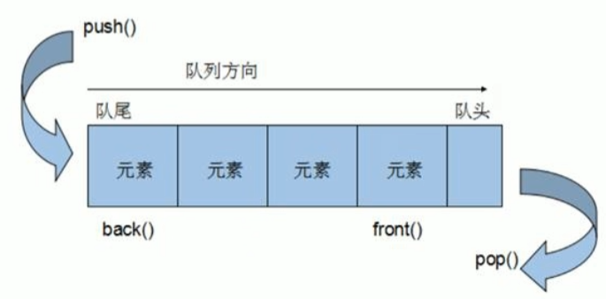
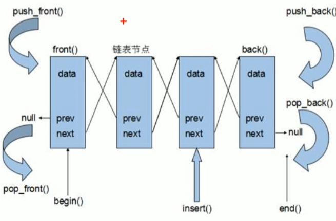

# c++提高编程

## 1模板

### 1.1模板的概念

模板就是建立通用的模具，提高代码复用性

模板不能直接使用，只是一个框架

模板不是万能的

### 1.2函数模板

- c++另一种编程思想称为**泛型编程**，主要利用的技术就是模板
- c++提供**函数模板**和**类模板**两种模板机制

#### 1.2.1函数模板语法

作用：建立一个通用函数，其函数返回值类型和形参类型可以不具体制定，用一个**虚拟的类型**来表示

语法：

```c++
template<typename T>
函数声明或定义
```

解释：

template - 声明创建模板

typename - 表明其后面的符号是一种数据类型，可以用class代替

T - 通用的数据类型，名称可以替换，通常为大写字母

```c++
template <typename T>
void swapInt(T &a, T &b)
{
	T temp = a;
	a = b;
	b = temp;
}
int main() {
	int a = 10;
	int b = 20;
	//1,自动类型推导
	swapInt(a,b);
	//2,显示指定类型
	swapInt<int>(a, b);
	return 0;
}
```

#### 1.2.2函数模板注意事项

- 自动类型推导，必须推导出一致的数据类型T,才可以使用
- 模板必须要确定出T的数据类型，才可以使用

```c++
template <calss T>
void func(T &a, T &b)
{
}
fun<int>();//必须指定类型
```

#### 1.2.3案例：通用数据排序

```c++
template <class T>
void mySwap(T& a, T& b)
{
	T temp = a;
	a = b;
	b = temp;
}
//选择排序
template <class T>
void mySort(T arr[], int len)
{
	for (int i = 0; i < len; i++)
	{
		int max = i;//认定最大值的下标
		for (int j = i + 1; j < len; j++)
		{
			//认定的最大值比遍历出的数值小，说明j下标元素才是最大值
			if (arr[max] < arr[j])
			{
				max = j;//更新最大值下标
			}
		}
		if (max != i)
		{
			//交换max和i元素
			mySwap(arr[max], arr[i]);
		}
	}
}
template<class T>
void printArray(T arr[], int len)
{
	for (int i = 0; i < len; i++)
	{
		cout << arr[i] << " ";
	}
	cout << endl;
}
void test01()
{
	//测试数组
//	char arr[] = "badcfe";
	int arr[] = {1,2,4,5,3,64,9};
	int num = sizeof(arr) / sizeof(arr[0]);
	mySort(arr,num);
	printArray(arr,num);
}
```

#### 1.2.4普通函数与函数模板区别

- 普通函数调用时可以发生自动类型转换（隐式类型转换）
- 函数模板调用时，如果利用自动类型推导，不会发生隐式类型转换
- 如果利用显示指定类型的方式，可以发生隐式类型转换

```c++
//普通函数
int myAdd1(int a, int b)
{
    return a+b;
}
//函数模板
template<class T>
T myAdd2(T a, T b)
{
    return a+b;
}
void test()
{
    int a = 10;
    int b = 20;
    char c = 'a';//a - 97
    myAdd1(a,c);//成立 隐式转换了
    //自动类型推导
    myAdd2(a,b);
    myAdd2(a,c);//报错  
    //显示指定类型
    myAdd2<int>(a,c);//成立  隐式转换
}
```

#### 1.2.5普通函数与函数模板的调用规则

1. 如果函数模板和普通函数都可以实现，**优先**调用普通函数
2. 可以通过**空模板参数列表**来强制调用函数模板，`myPrint<>(a,b);`
3. 函数模板也可以发生重载
4. 如果函数模板可以产生更好的匹配，优先调用函数模板(例如普通函数需要隐式转换后，函数模板更适配)

> 为避免二义性，不要写普通函数和函数模板一样的命名

#### 1.2.6函数模板的局限性

例如数组不能直接赋值

`T a = T b;` 

若a和b是数组，则无法实现

再例如：

```c++
template<class T>
void f(T a, T b)
{
	if(a>b){}
}
```

若a和b是自定义Person数据类型，也无法正常运行

c++为了解决这种问题，提供模板的重载，可以为这些**特定类型**提供**具体化的模板**

```c++
template<class T>
bool myCompare(T &a,T &b)
{...}
//具体化的模板，遇到Person优先执行
template<> bool myCompare(Person &p1, Person &p2)
{...}
```

> 学习模板是为了在STL中运用系统模板

### 1.3类模板

#### 1.3.1 类模板

语法：

```c++
template<class NameType, class AgeType>
class Person
{
public:
  Person(NameType name, AgeType age)
  {
      mname = name;
      mage = age;
  }
 NameType mname; 
 AgeType mage;
};
void test()
{
    Person<string,int> p1("he",24);
}
```

#### 1.3.2 类模板和函数模板的区别

1. 类模板没有自动类型推导的使用方式
2. 类模板在模板参数列表中可以有默认参数

```c++
template<class NameType, class AgeType = int>//默认参数
Person<string> p1("ping",25);//有默认可以省略一个类型
```

#### 1.3.3 类模板中成员函数的创建时机

- 普通类中成员函数是一开始就可以创建
- 类模板中的成员函数是在调用的时候才创建

#### 1.3.4 类模板对象做函数参数

一共有三种传入方式：

- 指定传入类型 --- 直接显示对象的数据类型
- 参数模板化    --- 将对象中的参数变为模板进行传递
- 整个类模板化 --- 将这个对象类型模板化进行传递

```c++
//1、指定传入类型
void printPerson1(Person<string,int>&p)
{}
void test1()
{
    Person<string, int>p("he",100);
    printPerson1(p);
}
//2、参数模板化
template<class T1, class T2>
void printPerson2(Person<T1,T2>&p)
{cout<<typeid(T1).name()}//查看类型
void test2()
{
    Person<string, int>p("ping",90);
    printPerson2(p);
}
//3、整个类模板化
template<class T>
void printPerson3(T &p)
{}
```

> 第一种：指定传入类型最常用

#### 1.3.5 类模板与继承

需要注意：

- 子类继承的父类是一个类模板时，子类在声明时，需要指定出父类中T的类型
- 如果不指定，编译器无法给子类分配内存
- 如果想灵活指定出父类中T的类型，子类也需要变成类模板

```c++
template<class T>
class Base
{
    T m;
};
//指定类型
class Son:public Base<int>
{};
//灵活指定
template<class T1, class T2>
class Son2:public Base<T2>
{
    T1 obj;
};
```

#### 1.3.6类模板成员函数类外实现

```c++
//构造函数类外实现
template<class T1, class T2>
Person<T1,T2>::Person(T1,name, T2 age)
{
    this->name = name;
    this->age = age;
}
```

#### 1.3.7类模板分文件编写

容易出现问题：

- 类模板成员函数创建时机是在调用阶段，导致分文件编写时链接不到

解决：

- 方法1：直接包含.cpp源文件
- **方法2**：将声明和实现写到同一个文件，并更改后缀名为.hpp，hpp是约定的名称，并不是强制。

#### 1.3.8类模板与友元

全局函数类内实现 - 直接在类内声明友元即可

全局函数类外实现 - 需要提前让编译器知道全局函数的存在

```c++
//提前让编译器知道Person类存在
template<class T1,class T2>
class Person;

//类外实现
template<class T1,class T2>
void printPerson2(Person<T1, T2> p)
{
	cout << p.age << endl;
};

template<class T1, class T2>
class Person
{
	//类内实现
	friend void printPerson(Person p)
	{
		cout << p.age << endl;
	}
	friend void printPerson2<>(Person p);
public:
	Person(T1 name, T2 age);
private:
	T1 name;
	T2 age;
};

template<class T1, class T2>
Person<T1, T2>::Person(T1 name, T2 age)
{
	this->age = age;
	this->name = name;
}
void test01()
{
	Person<string, int> p("孙", 100);
	printPerson(p);
}
```

#### 1.3.9类模板案例：通用数组类

- 对内置数据类型及自定义数据类型进行存储
- 将数组数据存到堆区
- 构造函数中可以传入数组的容量
- 提供对应的拷贝构造函数以及operator=防止浅拷贝问题
- 提供尾插法和尾删法对数组中数据进行增加和删除
- 可以通过下标访问数组中的元素
- 可以获取数组中当前元素的个数和数组容量


## 2 STL初识

### 2.1诞生

- 希望建立一种可重复利用的东西
- c++面向对象和泛型编程思想，提升复用性
- 大多数情况下，数据结构和算法未能统一
- 为了建立数据结构和算法的一套标准，诞生了STL

### 2.2 STL基本概念

- STL(Standard Template Library,标准模板库)
- STL从广义上分：容器(container)算法(algorithm)迭代器(iterator)
- 容器和算法之间通过迭代器进行无缝连接
- STL几乎所有的代码都采用了模板类或者模板函数

### 2.3 STL六大组件

容器，算法，迭代器，仿函数，适配器（配接器），空间配置器

1. 容器：各种数据结构，如vector，list，deque，set，map等，用来存放数据
2. 算法：各种常用算法，如sort,find,copy,for_each等
3. 迭代器：扮演了容器和算法之间的胶合剂
4. 仿函数：行为类似函数，可以作为算法的某种策略
5. 适配器：一种用于修饰容器或者仿函数或迭代器接口的东西
6. 空间配置器：负责空间的配置与管理

### 2.4 STL中容器、算法、迭代器

**容器：**置物之所

STL容器就是将运用最广泛的一些数据结构实现出来

常用的数据结构：数组、链表、树，栈，队列，集合，映射表等

这些容器分为**序列式容器**和**关联式容器**两种：

- 序列式容器：强调值的排序，序列式容器中每个元素均有固定的位置
- 关联式容器：二叉树结构，各元素之间没有严格的物理上的顺序关系

**算法：**问题之解法

有限的步骤，解决逻辑或数学上的问题，称为算法（Algorithm）

算法分为质变算法和非质变算法：

- 质变算法：运算过程中会更改区间内的元素的内容，例如拷贝，替换，删除等
- 非质变算法：不会更改区间内元素内容，如查找，计数，遍历等

**迭代器**：容器和算法之间的粘合剂

提供一种方法，使之能依次寻访某个容器所含的各个元素，而又无需暴露该容器的内部表示方式。

每个容器都有自己专属的迭代器

迭代器的使用类似于指针，初学阶段我们可以先理解为指针

迭代器种类：

| 种类           | 功能                                                     | 支持运算                           |
| -------------- | -------------------------------------------------------- | ---------------------------------- |
| 输入迭代器     | 对数据的只读访问                                         | 只读，支持++、==、！=              |
| 输出迭代器     | 对数据的只写访问                                         | 只写，支持++                       |
| 前向迭代器     | 读写操作，并能向前推进迭代器                             | 读写，支持++，==，！=              |
| 双向迭代器     | 读写操作，并能向前和向后操作                             | 读写，支持++，--                   |
| 随机访问迭代器 | 读写操作，可以以跳跃的方式访问任意数据，功能最强的迭代器 | 读写，支持++，--，[n],-n,<,>,<=,>= |

> 常用的容器中迭代器种类为**双向迭代器和随机访问迭代器**。

### 2.5 容器算法迭代器初识

#### 2.5.1 vector存放内置数据类型

容器：`vector`

算法：`for_each`

迭代器：`vector<int>::iterator`

```c++
#include<iostream>
#include<vector>
#include<algorithm>
using namespace std;


void myPrint(int val)
{
	cout << val << endl;
}
void test01()
{
	//创建vector
	vector<int> v;
	//尾部插入数据
	v.push_back(10);
	v.push_back(20);
	v.push_back(30);
	v.push_back(40);
	//通过迭代器访问数据
	//vector<int>::iterator itBegin = v.begin();//起始迭代器，只想第一个元素
	//vector<int>::iterator itEnd = v.end();//结束迭代器，指向最后一个元素的下一个
	////第一种遍历
	//while (itBegin != itEnd)
	//{
	//	cout << *itBegin << endl;
	//	itBegin++;
	//}
	//第二种遍历
	for (vector<int>::iterator it = v.begin(); it != v.end(); it++)
	{
		cout << *it << endl;
	}
	//第三种遍历 利用官方提供的遍历算法
	for_each(v.begin(), v.end(), myPrint);//myPrint回调函数
}
```

#### 2.5.2 vector存放自定义数据类型

```c++
for (vector<Person>::iterator it = v.begin(); it != v.end(); it++)
{
    cout << it->m_name <<(*it).m_age << endl;//两种方式
}
```

#### 2.5.3 vector嵌套容器

```c++
for (vector<vector<int>>::iterator it = v.begin(); it != v.end(); it++)
{
    //*it 容器vector<int>
    for (vector<int>::iterator it1 = (*it).begin(); it1 != (*it).end(); it1++)
    {
        //*it1 int类型
        cout << (*it1) << " ";
    }
    cout << endl;
}
```

## 3 STL常用容器

### 3.1 string容器

#### 3.1.1 string基本概念

- string是c++风格的字符串，本质上是一个类
- char *是一个指针，string内部封装了char *，管理这个字符串，是一个char *型的容器

特点：

- string类内部封装了很多成员方法，例如查找、拷贝，删除和替换，插入
- string管理char *所分配的内存，不用担心复制越界和取值越界等，由类内部负责

#### 3.1.2 string构造函数

构造函数原型：

- `string();`  //创建一个空字符串，如string str；

  `string(const char* s);` //使用字符串s初始化

- `string(const string& str);` //使用string对象初始化另一个string对象

- `string(int n, char c);` //使用n个字符c初始化

#### 3.1.3 string赋值操作

- `string& operator=(const char* s);` //把char*类型的字符串赋值给当前字符串
- `string& operator=(const string& s);` //把字符串s
- `string& operator=(char c);` //把字符c
- `string& assign(const char *s);`
- `string& assign(const char *s, int n);` //把字符串s前n个字符赋值给当前字符串
- `string& assign(const string &s);`
- `string& assign(int n, char c);`

#### 3.1.4 string字符串拼接

- `string& operator+=(const char* str);`//重载+=运算符
- `string& operator+=(const char c);`
- `string& operator+=(const string& str);`//重载+=运算符
- `string& append(const char *s);` //把字符串s拼接到末尾
- `string& append(const char *s, int n);` //把s前n个字符拼接
- `string& append(const string &s);`
- `string& append(const string &s,int pos, int n);` //字符串s中从pos开始的n个字符串拼接到末尾

#### 3.1.5 string查找和替换

- `int find(const string& str, int pos = 0) const;` //查找第一次出现str的位置，从pos开始查找
- `int find(const char* s, int pos = 0) const;` //查找第一次出现s的位置，从pos开始查找
- `int find(const char* s, int pos,int n) const;` //从pos位置查找s的前n个字符第一次出现的位置
- `int find(const char c, int pos = 0) const;` //查找字符c第一次出现的位置
- `int rfind(const string& str, int pos = npos) const;`//查找str最后一次位置，从pos开始找
- `int rfind(const char* s, int pos = npos) const;` //查找最后出现s的位置，从pos开始查找
- `int rfind(const char* s, int pos,int n) const;` //从pos位置查找s的前n个字符最后出现的位置
- `int rfind(const char c, int pos = 0) const;` //查找字符c最后出现的位置
- `string& replace(int pos, int n, const string& str);`//替换从pos开始n个字符为字符串str
- `string& replace(int pos, int n, const char* s);`//替换从pos开始n个字符为字符串s

#### 3.1.6 string字符串比较

字符串比较是按照字符的ASCII码进行对比

= 返回 0

\> 返回 1

< 返回 -1

- `int compare(const string &s) const;`

- `int compare(const char *s) const;`

#### 3.1.7 string字符存取

- `char& operator[](int n);`//通过【】获取

- `char& at(int n); `//通过at方法获取

#### 3.1.8 string插入和删除

- `string& insert(int pos, const char* s);` //插入字符串
- `string& insert(int pos, const string& s);` //插入字符串
- `string& insert(int pos, int n, char c);` //指定位置插入n个字符c
- `string& erase(int pos, int n =  npos);` //删除从pos开始的n个字符

#### 3.1.9 string子串

- `string substr(int pos = 0, int n = npos) const;`//返回由pos开始的n个字符组成的字符串

```c++
string email = "hum_hp@qq.com";
int pos = email.find('@');
cout <<  email.substr(0,pos) << endl;//获取用户名
```

### 3.2 vector容器

#### 3.2.1 vector基本概念

功能：vector数据结构和数组非常相似，也称为**单端数组**

与数组区别：数组是静态空间，vector可以**动态扩展**

动态扩展：并不是在原空间之后续接新空间，而是找更大的内存空间，然后将原数据拷贝新空间，释放原空间



- vector容器的迭代器是支持随机访问的迭代器

#### 3.2.2 vector构造函数

- `vector<T> v;` //采用模板实现类实现，默认构造函数
- `vector(v.begin(),v.end());`//将v[begin(), end())区间元素拷贝给自身
- `vector(n,elem);`//构造函数将n个elem拷贝给本身
- `vector(const vector &vec);`//拷贝构造函数

#### 3.2.3 vector赋值操作

- `vector& operator=(const vector &vec);`//重载等号操作符
- `assign(beg,end);`//将[beg,end)区间数据拷贝赋值给本身
- `assign(n,elem);`//将n个elem拷贝赋值给本身

#### 3.2.4 vector容量和大小

- `empty();` //判断容器是否为空
- `capacity();` //容器的容量(大于等于size)
- `size();` //返回元素个数
- `resize(int num);` //重新指定容器的长度为num，若容器变长，则以默认值填充新位置，若容器变短则末尾的元素删除
- `resize(int num，elem);` //重新指定容器的长度为num，若容器变长，则以elem值填充新位置，若容器变短则末尾的元素删除

```c++
vector<int> v1;
for(int i = 0;i<10;i++)
{
    v1.push_back(i);
}//赋初值
v1.capacity();//13
v1.size();//10
v1.resize(15);//默认用0填充
v1.resize(15,1);//指定以1填充
```

#### 3.2.5 vector插入和删除

- `push_back(ele);`//尾部插入元素ele
- `pop_back(ele);`//删除最后一个元素
- `insert(const_iterator pos, ele);`//迭代器指向位置pos插入元素ele
- `insert(const_iterator pos, int count, ele);`//pos插入count个ele
- `erase(const_iterator pos);`//删除迭代器指向的元素
- `erase(const_iterator start, const_iterator end);`//删除从start到end之间的元素
- `clear();`//删除所有元素

#### 3.2.6 vector数据存取

- `at(int idx);`//返回索引idx所指数据
- `operator[];`//返回索引idx所指数据
- `front();`//返回容器第一个数据元素
- `back();`//返回容器最后一个数据元素

#### 3.2.7 vector互换容器

`swap(vec);`//将vec与本身元素互换

实际使用中可以

- 收缩内存空间，

  ```c++
  vector<int> v(1000,1);
  v.resize(3);//resize()后不能将多余空间释放，造成浪费
  cout<<v.size()<<v.capacity()<<endl;//前3后1000多
  vector<int>(v).swap(v);//v构造匿名对象，然后与v发生交换
  cout<<v.size()<<v.capacity()<<endl;//都为3
  ```

#### 3.2.8 vector预留空间

减少vector在动态扩展容量时的扩展次数

`reserve(int len);`//容器预留len个元素长度，预留位置不初始化，元素不可访问

### 3.3 deque容器

#### 3.3.1 deque容器基本概念

- 双端数组，可以对头端和尾端进行插入删除操作

deque和vector的区别：

- vector对于头部的插入删除效率低，数据量越大，效率越低
- deque相对而言，对头部数据插入删除速度会快
- vector访问元素时的速度会比deque快，这和两者内部实现有关



内部工作原理：

deque内部有一个**中控器**，维护每段缓冲区中的内容，缓冲区存放真实数据

中控器维护的是每个缓冲区的地址，使得使用deque时像一片连续的内存空间



deque容器的迭代器也是支持随机访问的

#### 3.3.2 deque构造函数

- `deque<T> deqT;`
- `deque(beg,end);`
- `deque(n,elem);`
- `deque(const deque &deq);`

```c++
void printDeque(const deque<int>&d)//加入const防止修改d 后面const_iterator
{
    for(deque<int>::const_iterator it = d.begin();it!=d.end();it++)
    {
        cout <<*it<<endl;
    }
}
```


#### 3.3.3 deque赋值操作

与vector一样

#### 3.3.4 deque大小操作

deque没有容量，其他和vector一致

#### 3.3.5 deque插入和删除

两端插入删除：

- `push_back(elem);`
- `push_front(elem);`
- `pop_back();`//删最后
- `push_front();`//删第一个

指定位置操作：

- `insert(pos,elem);`//在pos位置插入elem，返回新数据的位置
- `insert(pos,n,elem);`//在pos位置插入n个elem，无返回

- `insert(pos,beg,end);`//在pos位置插入[ )区间数据，无返回

- `clear();`//清空
- `erase(pos);`//删除pos位置的数据，返回下一个数据的位置

> 提供的位置是迭代器

#### 3.3.6 deque数据存取

与vector一致

#### 3.3.7 deque排序

- `sort(iterator beg, iterator end)`//对区间进行排序

需要包含Algorithm头文件，对于支持随机访问的迭代器容器，都可以用sort算法进行排序，因此vector也可以用sort排序

### 3.4 [案例：评委打分](https://github.com/humphreyde/cpp-learning/blob/master/%E5%AE%B9%E5%99%A8/stringVectorDequeDemo.cpp)

### 3.5 stack容器

#### 3.5.1 基本概念

stack是一种**先进后出**(First In Last Out,FILO)的数据结构，只有一个出口



栈中只有顶端的元素才可以被外界使用，因此栈不允许有遍历行为

栈可以判断是否为空(empty)，可以返回元素个数(size)

栈中进入数据称为入栈`push`

栈中弹出数据称为出栈`pop`

#### 3.5.2 stack常见接口

构造函数：

- `stack<T> stk;`  //模板类实现，stack对象默认构造
- `stack(const stack &stk);` //拷贝构造

赋值操作：

- `stack& operator=(const stack &stk);` //重载等号操作符

数据存取：

- `push(elem);` //栈顶添加元素
- `pop();` //栈顶移除元素

- `top();`//返回栈顶元素

大小操作：

- `empty();`
- `size();`

code:

```c++
//栈：先入后出
stack<int>s;
//入栈
s.push(10);
s.push(20);
s.push(30);
s.push(40);
//只要栈不为空，查看栈顶，弹出
while (!s.empty())
{
    cout << "栈顶元素为：" << s.top() << endl;
    s.pop();
}
cout << s.size() << endl;
```

### 3.6 queue容器

#### 3.6.1 基本概念

queue是一种先进先出（FIFO）的数据结构，他有两个出口



队列容器允许一端新增数据，另一端移除数据

队列中只有队头和队尾才可以被外界使用，因此不允许遍历

进入数据称为**入队**`push`

出数据称为**出队**`pop`

#### 3.6.2 常用接口

构造函数：

- `queue<T> que;`  //模板类实现，queue对象默认构造
- `queue(const queue &que);` //拷贝构造

赋值操作：

- `queue& operator=(const queue &que);` //重载等号操作符

数据存取：

- `push(elem);` //队尾添加元素
- `pop();` //队头移除元素

- `back();`//返回最后一个元素
- `front();`//返回第一个元素

大小操作：

- `empty();`
- `size();`

### 3.7 list容器

#### 3.7.1 list基本概念

定义：

- 链式存储结构，将数据进行链式存储

特点：

- 物理存储单元式非连续的存储结构，数据元素的逻辑顺序是通过指针链实现的

组成：

- 链表由一系列的结点组成，每个结点包括数据域和指向下一个结点地址的指针域

优点：

- 任意位置进行快速插入或删除元素，不需要移动大量数据
- 采用动态存储分配，不会造成内存浪费和溢出

缺点：

- 遍历速度慢
- 占用空间比数组多

STL中的链表是一个**双向循环链表**（图中没有循环）



由于链表存储方式并不是连续的内存空间，因此链表list中的迭代器只支持前移和后移，属于**双向迭代器**

list还有一个性质，插入和删除操作不会造成原来的list迭代器的失效，vector则不成立

#### 3.7.2 构造函数

- `list<T> lst;`
- `list(beg,end);`
- `list(n,elem);`
- `list(const list &lst);`

#### 3.7.3 赋值和交换

- `assign(beg,end);`
- `assign(n,elem);`
- `list& operator=(const list &lst);`
- `swap(lst);` //将lst与本身元素进行交换

#### 3.7.4 大小操作

- `size();` //元素个数
- `empty();`//判断是否为空
- `resize(num);`
- `resize(num,elem)`

#### 3.7.5 插入和删除

- `push_back(elem);`
- `push_front(elem);`
- `pop_back();`//删最后
- `push_front();`//删第一个

- `insert(pos,elem);`//在pos位置插入elem，返回新数据的位置
- `insert(pos,n,elem);`//在pos位置插入n个elem，无返回

- `insert(pos,beg,end);`//在pos位置插入[ )区间数据，无返回

- `clear();`//清空
- `erase(pos);`//删除pos位置的数据，返回下一个数据的位置
- `erase(beg,end);`
- `remove(elem);`//删除所有与elem匹配的元素

#### 3.7.6 数据存取

不能随机访问[]

- `front();`
- `back();`

#### 3.7.7反转和排序

- `reverse();`

- `sort();`

不能用sort(lst)进行排序，所有不支持随机访问迭代器的容器，不可以使用标准算法

内部会提供对应算法：lst.sort(); 默认升序

```c++
//sort()降序
bool compare(int v1,int v2)
{
    return v1>v2;
}
//降序
lst.sort(compare);//仿函数？
```

#### 3.7.8排序案例

```c++
#include<iostream>
#include<algorithm>
#include <list>
using namespace std;

//将Person排序，年龄升序，若年龄相同则按照身高降序
class Person
{
public:
	Person(string name, int age, int heght)
	{
		this->m_age = age;
		this->m_name = name;
		this->m_heght = heght;
	}
	string m_name;
	int m_age;
	int m_heght;
};

void printL(const list<Person> &lst)
{
	for (list<Person>::const_iterator it = lst.begin(); it != lst.end(); it++)
		cout << it->m_name << it->m_age<<" 岁" <<" 身高" << it->m_heght << endl;
}
//排序规则
bool comparePerson(Person p1,Person p2)
{
	if (p1.m_age == p2.m_age)
	{
		//年龄相同后，身高排序
		return p1.m_heght > p2.m_heght;
	}
	else
	{
		//年龄排序
		return p1.m_age < p2.m_age;
	}
}
int main()
{
	Person p1("刘备",34,175);
	Person p2("关羽", 34, 205);
	Person p3("张飞", 32, 195);

	list<Person> lst;
	lst.push_back(p1);
	lst.push_back(p2);
	lst.push_back(p3);
	lst.sort(comparePerson);

	//降序
	printL(lst);
	system("pause");
	return 0;
}
```

### 3.8 set/multiset容器

#### 3.8.1 set基本概念

所有元素在插入时自动排序

本质是**关联式容器**，底层是**二叉树**实现

set和multiset的区别：

- set不允许有重复元素，multiset允许

#### 3.8.2 构造和赋值

构造：

- `set<T> st;`
- `set(const set &st);`

赋值：

- `set& operator=(const set &st);`

#### 3.8.3大小和交换

- `size();`  //返回元素数量
- `empty();`
- `swap(st);`

#### 3.8.4插入和删除

- `insert(elem);`//插入元素
- `clear();`//清空
- `erase(pos);`//删除pos位置的数据，返回下一个数据的迭代器
- `erase(beg,end);`//删除区间[）的所有元素，返回下一个元素的迭代器
- `erase(elem);`//删除容器中值为elem的元素

#### 3.8.5 查找和统计

- `find(key);` //查找key是否存在，存在返回该键的元素的迭代器，若不存在，则返回set.end();
- `count(key);`//统计key的元素的个数，对于set而言，只有0，1两种情况

```c++
set<int> st;
st.insert(12);
st.insert(11);
st.insert(30);
st.insert(14);
set<int>::iterator pos = st.find(30);
if (pos != st.end())
    cout << "find:" << *pos << "总共有"<<st.count(30)<<endl;
else
{
    cout << "not find!" << endl;
}
```

#### 3.8.6 set和multiset的区别

- set不可以插入重复数据
- set插入数据时会返回插入结果，表示插入是否成功
- multiset不会检测数据，因此可以插入重复数据

```c++
set<int> st;
st.insert(30);
st.insert(30);
pair<set<int>::iterator, bool> ret = st.insert(30);//对组
if (ret.second)
{
    cout << "插入成功" << endl;
}
else
{
    cout << "插入失败" << endl;
}
```

#### 3.8.7 pair对组创建

成对出现的数据，利用对组可以返回两个数据

两种创建方式：

- `pair<type,type> p (value1,value2);`

- `pair<type,type> p = make_pair(value1,value2);`

```c++
pair<string, int>p("Tom", 20);
pair<string, int>p2 = make_pair("Tom", 20);
cout << p.first << p.second << endl;
```

#### 3.8.8 指定排序规则-内置数据类型（仿函数）

改变set的排序规则为：从大到小

