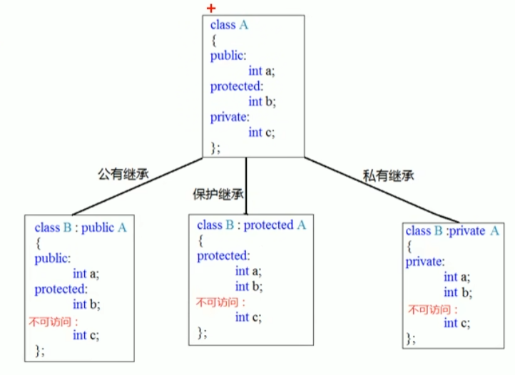
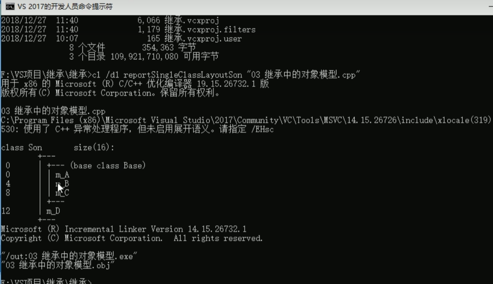
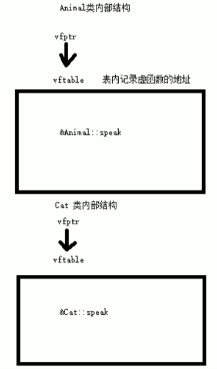

# C++面向对象

## 1 内存分区模型

C++程序在执行时，将内存分为四个区域：

- 代码区：存放函数体的二进制代码，由操作系统进行管理
- 全局区：存放全局变量和静态变量以及常量
- 栈区：由编译器自动分配释放，存放函数的参数值，局部变量等
- 堆区：由程序员分配和释放，若程序员不释放，程序结束后由操作系统回收

意义：不同区域存放的数据，赋予不同的生命周期，给我们更大的编程灵活性

### 1.1 程序运行前

程序编译后，生成了exe可执行程序，**未执行该程序**之前分为两个区域：

**代码区：**

- 存放CPU执行的机器指令
- 代牧区是**共享的**，共享的目的是对于频繁被执行的程序，只需要在内存中有一份代码即可
- 代码区是**只读的**，防止程序意外修改了它的指令

**全局区：**

- 全局变量和静态变量存放于此
- 全局区还包含了常量区，字符串常量和其他常量(const修饰的==全局==常量)存放于此
- 该区域的数据在**程序结束后由操作系统释放**

> 局部变量：函数内定义的变量
>
> 全局变量：函数体外定义的变量
>
> 静态变量：static 修饰的变量
>
> 常量：字符串常量(“hello”)，const修饰的变量（分为全局和局部，存放位置不同）

const修饰的==局部==变量不在全局区

### 1.2 程序运行后

**栈区：**

- 由编译器自动分配释放，存放函数的参数值,形参，局部变量等
- 注意：不要返回局部变量的地址，栈区开辟的数据由编译器自动释放

错误示例：

```c++
int* func()
{
	int a = 10;
	return &a;
}
```

**堆区：**

- 由程序员分配释放，若程序员不释放，程序结束后由操作系统回收
- 用new在堆区开辟内存,delete释放内存
- `new 数据类型`

code:

```c++
int* func()
{
	int *p = new int(10);//创建一个变量  
    //int *arr = new int[10]//创建数组：10个元素
	return p;
}
int main()
{
    int *p1 = func();
    cout <<*p <<endl;
    delete p1;//释放数组:delete[] arr;
}
```

## 2 引用

### 2.1 基本用法

作用：给变量起别名

语法：`数据类型 &别名 = 原名;`

### 2.2 注意事项

- 引用必须初始化
- 初始化后，不可以改变

### 2.3 引用做函数参数

作用：形参改变实参

有点：简化指针修改实参

### 2.4 引用做函数的返回值

注意：不要返回局部变量的引用

函数的调用可以作为左值

```c++
int& test()
{
    static int a = 10;//需要加static，不然是局部变量
    return a;
}
int main()
{
    //test() = 10;可作为左值
    int &ref = test();
    cout << ref << endl;
    cout << ref << endl;
    return 0;
}
```

### 2.5 引用的本质

引用的本质就是==指针常量==

指针的指向不可以改（p），指针指向的值可以改（*p）。

### 2.6 常量引用

作用：修饰形参防止误操作

```c++
int a = 10;
//加上const后，编译器将代码修改：int temp = 10; const int &ref = temp;
const int &ref = 10//int &ref = 10不允许  引用必须引用一块合法的内存空间(堆区和栈区，常量区不行)
//ref = 20;//错误,不可修改，常量引用，一般用作函数形参，防止函数内部修改实参
    
void test(const int& ref);
```

## 3 函数提高

### 3.1 函数默认参数

在C++中，函数的形参列表中的形参是可以有默认值的

语法：`返回值类型 函数名 （参数 = 默认值）{}`

注意事项：

- 如果某个位置有了默认参数，从这个位置往后，都必须有默认值
- 函数的声明和实现只能一个有默认参数（否则产生二义性）

### 3.2 函数占位参数

语法：`返回值类型 函数名 （数据类型）{}`

占位参数还可以有默认参数：`void func(int a, int = 10)`

### 3.3 函数重载

#### 3.3.1 概述

作用：函数名相同，提高复用性

函数重载满足条件：

- 同一个作用域下
- 函数名称相同
- 函数参数**类型**不同或者个数不同或者**顺序**不同

> 函数的返回值不可以作为函数重载的条件

#### 3.3.2 注意事项

- 引用作为重载条件
- 函数重载遇到函数默认参数

```C++
void func(int &a){}
void func(const int &a){}
//上面两个可以重载
void func2(int a){}
void func2(int a, int b = 10){}
//上面两个可以重载，但是调用函数时会出问题，func2（10）产生二义性，func2(10,20)可以
int main()
{
	int a = 10;
	func(a);//调用第一个 
	
	func(10);//调用第二个 const int &a = 10 合法  int &a = 10;不合法
}
```

## 4 类和对象

C++面向对象三大特性：==封装、继承、多态==

C++认为万物皆对象，对象有其**属性**和**行为**

例如：

- 人为对象，属性有姓名，身高，体重，行为有唱、跳、rap

### 4.1 封装

#### 4.1.1 封装的意义

封装是C++面向对象三大特性之一

- 将属性和行为作为一个整体，表现对象
- 将属性和行为加以权限控制

语法：`class 类名{ 访问权限：属性/行为};`

属性又名：成员属性  成员变量

行为又名：成员函数  成员方法


权限管理：

- public 	公共				成员 类内类外都可以访问
- protected 保护     		成员 类内可以访问 类外不可以（子类访问父类内容）
- private 私有                 成员  类内可以访问，类外不可以（子类不可访问）

```c++
class Person
{
public:
    string m_Name;
    void create()
    {
        m_Name = "张三";
        m_Car = "benz";
        m_Password = 123456;
    }
protected:
    string m_Car;
private:
    int m_Password;
}

int main()
{
    Person p1;
    p1.m_Name = "lisi";
    //p1.m_Car = "nb";//类外不可car和password访问
    p1.create)();
}
```

#### 4.1.2 struct和class区别

唯一区别在于默认访问权限不同

- struct默认权限为公告
- class默认权限为私有

#### 4.1.3 成员属性设置为私有

优点1：可以自己控制读写权限

优点2：对于写权限，可以检测数据的有效性

```C++
class Person
{
public:
    void setName();
	string getName();//name可读可写
    int getPassword();//pa只读
    void setCar();//只写
private:
    int m_Password; //只读
    string m_Name;  //可读可写
    string m_Car;	//只写
}
```

### 4.2 对象的初始化和清理

#### 4.2.1 构造函数和析构函数

对象的初始化和清理是非常重要的安全问题

C++利用构造函数和析构函数解决上述问题，会有编译器自动调用，但是编译器自定义的构造函数和析构函数是空实现

- 构造函数：主要用于创建对象时，对对象的成员属性赋值，由编译器自动调用
- 析构函数：主要是对象销毁前系统自动调用，执行一些清理工作

**构造函数语法**：`类名（）{}`

> 1. 没有返回值，也不写void
> 2. 函数名与类名相同
> 3. 构造函数可以有参数，因此可以重载
> 4. 创建对象时自动调用构造，无需手动调用，而且只会调用一次

**析构函数语法**：`~类名（）{}`

> 1. 析构函数，没有返回值也不写void
> 2. 函数名称与类名相同，名称前加~
> 3. 析构函数==不可以有参数==，因此不能重载
> 4. 程序在对象销毁前自动调用析构，无需手动调用，只会调用一次

#### 4.2.2 构造函数的分类及调用

两种分类方式：

1. 按照参数分类：有参构造和无参构造(默认构造)
2. 按照类型分为：普通构造和拷贝构造

> 默认构造不要加()，否则会认为是函数声明；
>
>  不要用拷贝构造函数初始化匿名对象

三种调用方式：

1. 括号法
2. 显示法
3. 隐式转换法

code：

```C++
class Person
{
public:
    Person()
    {
        cout << "无参构造" << endl;
    }
    Person(string name)
    {
        cout << "有参构造" << endl;
    }
    Person(const Person &p)
    {
        m_name = p.m_name;
        cout << "拷贝构造" << endl;
    }
    ~Person()
    {
        cout << "析构函数" << endl;
    }
private:
    string m_name;
};

void test()
{
    //括号法
    Person p1;  //默认构造不要加（）,否则会认为是函数声明
    Person p2("hepping");
    Person p3(p2);  //拷贝构造

    //显示法
    Person p4 = Person("heping"); //Person(10)称为匿名对象 特点：当前行执行完，系统立即回收
   // Person(p2);// 不要用拷贝构造函数初始化匿名对象，编译器会认为Person(p2) == = Person p2对象声明
    Person p5 = Person(p2);//拷贝构造

    //隐式转换法
    Person p6 = string("lisi");//相当于Person p6 = Person("lisi");
    Person p7 = p6;//拷贝构造
}
```

#### 4.2.3 拷贝构造函数的调用时机

- 使用一个旧对象来初始化一个新对象
- 值传递的方式给函数参数传值
- 以值方式返回局部对象

code：

```c++
void dowork(Person p)
{
}
Person doWork2() 
{
    Person p1;
    return p1;//返回局部对象，拷贝一个新对象
};
void test01()
{
    Person p;
    dowork(p);//值传递调用拷贝构造函数
    p = doWork2();//返回值是拷贝后的
}
```

#### 4.2.4 构造函数调用规则

默认情况下，C++编译器至少给一个类提供3个函数

1. 默认构造函数（无参，函数体为空）
2. 默认析构函数（无参，函数体为空）
3. 默认拷贝构造函数，对属性进行==值拷贝==

构造函数调用规则如下：

- **如果用户定义了有参构造函数，C++不再提供默认无参构造**，但是会提供默认拷贝构造
- 如果用户**定义了拷贝构造函数，C++不再提供别的构造函数**

#### 4.2.5 深拷贝与浅拷贝

面试经典问题

浅拷贝：简单的赋值拷贝操作

深拷贝：在堆区重新申请空间，进行拷贝操作

> 浅拷贝的问题就是堆区的内存重复释放，利用深拷贝进行改善，自己实现拷贝构造函数。
>
> 总结：如果属性有在堆区开辟的，一定要自己提供拷贝构造函数，防止浅拷贝带来的问题。

code：

```c++
class Person
{
public:
    Person()
    {
        cout << "无参（默认）构造" << endl;
    }
    Person(string name, int height)
    {
        m_name = name;
        m_height = new int(height);
        cout << "有参构造" << endl;
    }
    Person(const Person &p)
    {
        m_name = p.m_name;
        m_height = new int(*p.m_height);
        cout << "拷贝构造" << endl;
    }
    ~Person()
    {
        //将堆区数据释放
        if (m_height != NULL)
        {
            delete m_height;
            m_height = NULL;
        }
        cout << "析构函数" << endl;
    }

    string m_name;
    int* m_height;
};
void test01()
{
    Person p1("hp",160);
    Person p2(p1);//默认拷贝构造函数为浅拷贝
    cout << p1.m_name << "身高为：" << *p1.m_height << endl;
    cout << p2.m_name << "身高为：" << *p2.m_height << endl;
}
```

#### 4.2.6 初始化列表

作用：初始化列表用来初始化属性

语法：`构造函数（）：属性1（值1），属性2（值2）...{}`

```c++
Person(string name, int age):m_name(name), m_age(age)
{}
```

#### 4.2.7 对象成员

某一个类中的成员是另一个类的对象，称为对象成员

创建对象时，先构造对象成员，再构造本身对象。

析构相反，先析构本身对象，再析构对象成员。

#### 4.2.8 静态成员

成员变量和成员函数前加上关键词static

- 静态成员变量
  - 所有对象共享同一份数据
  - 在编译阶段分配内存（全局区）
  - 类内声明（`static int m_age;`），类外初始化（`int Person::m_age = 100;`）
  - 可以通过类名进行访问，也可以通过对象进行访问（public权限）
  
- 静态成员函数
  - 所有对象共享同一个函数
  - 静态成员函数只能访问静态成员变量
  - 可以通过类名进行访问，也可以通过对象进行访问（public权限）

### 4.3 C++对象模型和this指针

#### 4.3.1 成员变量和成员函数分开存储

在c++中，类的成员变量和成员函数分开存储

只有**非静态成员==变量==**才属于类的对象上。

空对象占用内存空间为：1个字节，为了区分空对象的位置。

其他对象所占空间取决于**非静态成员==变量==**的所占空间，非静态成员函数也只有一份。

#### 4.3.2 this指针

非静态成员函数也只有一份，如何区分哪个对象调用自己？

c++通过特殊的**对象指针**：this指针区分，this指针指向被调用的成员函数所属的对象。

this指针是隐含每一个**非静态成员函数**内的一种指针，无需定义，可直接使用。

用途：

- 当形参和成员变量同名时，可用this指针来区分
- 在类的非静态成员函数中返回对象本身，可使用`return *this`

```c++
Person(int age)
{
    this->age = age;//区分成员变量和形参
    cout << "Person有参构造" << endl;
}
```

```c++
Person& PersonAddAge(Person &p)//注意是返回引用Person&，否则会调用拷贝，返回新的对象
{
    this->m_age += p.m_age;
    return *this;
}

void test01()
{
    Person p1(10);
    Person p2(10);
    p1.PersonAddAge(p2).PersonAddAge(p2);//链式编程思想
    cout << p1.m_age << endl;
}
```

#### 4.3.3 空指针访问成员函数

C++中空指针也是可以调用成员函数的，但是也要注意有没有用到this指针

如果用到this指针，需要加以判断保证代码的健壮性

```c++
void showPersonAge()
{
    if (this == NULL)//加入这个增强健壮性
    {
        return;
    }
    cout << m_age << endl;
}
void showClassName()
{
    cout << "this is Person class" << endl;
}
void test01()
{
    Person* p = NULL;
    p->showClassName();
    p->showPersonAge();//报错,因为this指向NULL
}
```

#### 4.3.4 const修饰成员函数

常函数：

- 成员函数后加const为常函数
- 常函数不可修改成员属性
- 成员属性声明时加关键词mutable，在常函数中依旧可以修改

常对象：

- 声明对象前加const称为常对象
- 常对象不能修改成员属性
- 常对象只能调用常函数

```C++
//this指针的本质是指针常量，指针的指向是不可以修改的，指针指向的值可以修改
void writePersonAge() const//修饰this指针，让this指向的值也不能修改
{
    m_age = 100;//这里实际上是this->m_age=100;若不加const，是可以修改的
    //this = NULL;this指针不能修改指向
}
mutable int m_age;
```

> 常对象可以修改静态成员属性

### 4.4 友元

友元是让一个函数或者类访问另一个类的私有成员

友元的三种实现

- 全局函数做友元
- 类做友元
- 成员函数做友元

```c++
class Building
{
    //全局函数做友元
    friend void goodGay(Building& building);
public:
    string m_SittingRoom;

    Building()
    {
        m_SittingRoom = "客厅";
        m_BedRoom = "卧室";
    }
private:
    string m_BedRoom;
};

//全局函数访问私有成员和公共成员
void goodGay(Building &building)
{
    cout << "好基友访问" << building.m_SittingRoom << endl;
    cout << "好基友访问" << building.m_BedRoom <<endl;

}
```

类做友元

```c++
class Building
{
    //类做友元
    friend class GoodGay;
public:
    string m_SittingRoom;

    Building()
    {
        m_SittingRoom = "客厅";
        m_BedRoom = "卧室";
    }
private:
    string m_BedRoom;
};
//友元类
class GoodGay 
{
public:
    Building* building;
    GoodGay();
    void visit();
};
//类外实现
void GoodGay::visit()
{
    cout << "好基友访问" << building->m_SittingRoom << endl;
    cout << "好基友访问" << building->m_BedRoom << endl;
}
GoodGay::GoodGay()
{
    building = new Building;
}
```

成员函数做友元

```c++
class Building;
class GoodGay 
{
public:
    Building* building;
    GoodGay();
    void visit();//成员函数做友元
    void visit2();
};

class Building
{
    //成员函数做友元
    friend void GoodGay::visit();
public:
    string m_SittingRoom;

    Building()
    {
        m_SittingRoom = "客厅";
        m_BedRoom = "卧室";
    }
private:
    string m_BedRoom;
};
//类外实现,注意这段必须先做声明，然后类外做函数实现，这段需放在BUilding类后
void GoodGay::visit()
{
    //都可以访问
    cout << "好基友访问" << building->m_SittingRoom << endl;
    cout << "好基友访问" << building->m_BedRoom << endl;
}
void GoodGay::visit2()
{
    //bedroom不可以访问
    cout << "好基友访问" << building->m_SittingRoom << endl;
    //  cout << "好基友访问" << building->m_BedRoom << endl;
}
GoodGay::GoodGay()
{
    building = new Building;
}
```

### 4.5 运算符重载

概念：对已有的运算符重新进行定义，赋予另一种功能

运算符重载也能发生函数重载

#### 4.5.1 加号重载+

自定义类型的加法计算

```c++
class Person {
public:
	//成员函数重载+号
	Person operator+(Person &p)
	{
		Person temp;
		temp.m_a = this->m_a + p.m_a;
		temp.m_b = this->m_b + p.m_a;
		return temp;
	}
	int m_a;
	int m_b;
};
//2.全局函数重载+号
Person operator+(Person &p1, Person& p2)
{
	Person temp;
	temp.m_a = p1.m_a + p2.m_a;
	temp.m_b = p1.m_b + p2.m_a;
	return temp;
}
void test1()
{
	Person p1, p2;
	p1.m_a = p1.m_b = 10;
	p2.m_a = p2.m_b = 5;
	Person p3 = p1 + p2;
	//成员函数本质调用Person p3 = p1.operator+(p2);
	//全局函数本质调用Person p3 = operator+(p1,p2);
}
```

> 内置数据类型的运算不能改变运算符规则
>
> 不要滥用

#### 4.5.2 左移重载<<

```C++
class Person {
public:
	//通常不用成员函数重载<<
	//Person operator<<(Person &p)
	//{
	//}
	int m_a;
	int m_b;
};
//2.全局函数重载<<号
ostream& operator<<(ostream &cout, Person& p)
{
	cout << p.m_a ;
	return cout;
}
void test1()
{
	Person p1;
	p1.m_a = p1.m_b = 10;
	cout << p1 << endl;
}
```

#### 4.5.3 递增重载++

```C++
class MyInteger
{
	friend ostream& operator<<(ostream& cout, MyInteger p);
public:
	MyInteger() :m_Num(0) {}
	//重载前置++,先++，再返回
	MyInteger& operator++()//返回引用，一直对一个变量++
	{
		m_Num++;
		return *this;
	}
	//重载后置++,先返回，再++
	MyInteger operator++(int)//返回值,int占位参数，用于区分前置后置
	{
		MyInteger temp = *this;
		m_Num++;
		return temp;
	}

private:
	int m_Num;
};
ostream& operator<<(ostream& cout, MyInteger p)
{
	cout << p.m_Num;
	return cout;
}
void test1()
{
	MyInteger myint;
	cout << ++myint << endl;
	cout << myint << endl;
}
```

#### 4.5.4 赋值重载=

C++编译器至少给一个类添加4个函数

1. 默认构造
2. 默认析构
3. 默认拷贝构造，对属性进行值拷贝
4. 赋值运算符operator=，对属性进行值拷贝

如果类中有属性指向堆区，做赋值操作时也会出现深浅拷贝问题。

```C++
class Person
{
public:
    Person(int height)
    {
        m_height = new int(height);
        cout << "有参构造" << endl;
    }

    ~Person()
    {
        //将堆区数据释放
        if (m_height != NULL)
        {
            delete m_height;
            m_height = NULL;
        }
        cout << "析构函数" << endl;
    }
    //重载赋值运算符
    Person& operator=(Person &p)
    {
        if (m_height != NULL)
        {
            delete m_height;
            m_height = NULL;
        }
        m_height = new int(*p.m_height);
        return *this;
    }

private:
    int* m_height;
};
void test01()
{
    Person p1(160);
    Person p2(170);
    Person p3(150);
    p2 = p1 = p3;
}
```

#### 4.5.5 关系运算符重载==,>,!=

```C++
//重载赋值运算符
bool operator==(Person &p)
{
    if (this->m_height == p.m_height)
        return true;
    return false;
}
```

#### 4.5.6 函数调用运算符重载（）

也称为仿函数，没有固定写法，非常灵活

```c++
class MyPrint
{
public:
    void operator()(string test)
    {
        cout << test << endl;
    }
};
void test01()
{
    MyPrint myPrint;
    myPrint("hello world");//非常像调用函数，因此称为仿函数
}
```

### 4.6 继承

#### 4.6.1 基本语法

继承是面向对象三大特性之一

具有上级的共性还有自己的特性，减少重复代码

语法：`class 子类:继承方式 父类{};`

子类也称为派生类，父类也称为基类。

派生类的成员包括自己的和基类的。

#### 4.6.2 继承方式

公共，保护和私有：

子类任何继承方式都不能访问父类私有内容。



```c++
class Base
{
public:
	int m_a;
protected:
	int m_b;
private:
	int m_c;
};
class Son :public Base
{
public:
	void func()
	{
		m_a = 10;//公共权限变公共
		m_b = 10;//保护权限变保护，类内可以访问
		//m_c私有权限不可访问
	}
};
void test01()
{
	Son s1;
	s1.m_a = 100;
	//s1.m_b 保护权限，类外不能访问
}
```

#### 4.6.3 继承中的对象模型

父类继承过来的成员，哪些属于子类？

利用开发人员命令提示工具（vs）查看对象模型

- 跳转盘符 F:
- 跳转文件路径 cd具体路径
- 查看命名
- `c1 /d1 reportSingleClassLayout类名 CPP文件名`



```c++
class Base
{
public:
	int m_a;
protected:
	int m_b;
private:
	int m_c;
};
class Son :public Base
{
public:
	int m_d;
};
void test01()
{
	//结果：16，父类中所有的非静态成员属性都会被继承，只是私有成员被编译器隐藏了
	cout << sizeof(Son) << endl;
}
```

#### 4.6.4 继承中构造和析构的顺序

子类继承父类，创建子类对象时，也会调用父类的构造函数

问题：子类和父类的构造和析构谁先谁后？

先构造父类，再构造子类，析构与构造顺序相反。

#### 4.6.5 继承同名成员处理方式

当子类与父类出现同名的成员，如何通过子类对象，访问子类或者父类中的同名数据呢？

- 访问子类同名成员，直接访问即可
- 访问父类同名成员，需要加作用域

```c++
Son s1;
cout << s1.m_a << endl;//访问子类
cout << s1.Base::m_a << endl;//访问父类
```

- 成员函数同名时，如果子类出现和父类同名的成员函数，子类的同名成员函数会隐藏父类中所有的同名成员函数，包括重载函数，如果要访问，需要加作用域：：。

#### 4.6.6 继承同名静态成员处理方式

与非静态成员一致(同4.6.5)

```c++
//通过对象
s.func();
s.Base::func();
//通过类
Son::func();
Son::Base::func();
Son::Base::func(100);//子类的同名成员函数会隐藏父类中所有的同名成员函数
```

#### 4.6.7 多继承

C++允许一个类继承多个类

语法：`class 子类：继承方式 父类1，继承方式 父类2...`

多继承可能会引发父类出现同名成员，需要加作用域区分

**C++实际开发不建议使用多继承**，会产生二义性

```c++
class Base1
{
public:
	int m_a;
	Base1() :m_a(100) {}
};
class Base2
{
public:
	int m_a;
	Base2() :m_a(50) {}
};
class Son :public Base1,public Base2
{
public:
	Son() :m_a(10) {}
	int m_a;
};
void test01()
{
	Son s1;
	cout << s1.m_a << endl;//访问子类
	cout << s1.Base1::m_a << endl;//访问父类1
	cout << s1.Base2::m_a << endl;//访问父类2
}
```


#### 4.6.8 菱形继承及问题

两个派生类继承同一个基类，又有某个类同时继承两个派生类，这种称为菱形继承，或钻石继承

**菱形继承问题：**

- 二义性问题 。通过加作用域解决
- 数据重复问题，两份继承于基类的相同数据。通过虚继承解决

```c++
class Base
{
public:
	int m_a;
	Base() :m_a(100) {}
};
class Son1 : public Base{};
class Son2 : public Base{};
class GrandSon :public Son1, public Son2{};

void test01()
{
	GrandSon s1;
    s1.Son1::m_a = 50;
	//cout << s1.m_a << endl;//产生二义性
	cout << s1.Son1::m_a << endl;//访问子类1 50
	cout << s1.Son2::m_a << endl;//访问子类2 100
	cout << sizeof(s1) << endl;//有2份数据！父类继承的数据重复！
}
```

虚继承：

```c++
class Base
{
public:
	int m_a;
	Base() :m_a(100) {}
};
//通过虚继承，解决菱形继承的问题
//加上virtual变虚继承,Base称为虚基类
class Son1 : virtual public Base{};
class Son2 : virtual public Base{};
class GrandSon :public Son1, public Son2{};

void test01()
{
	GrandSon s1;
	s1.Son1::m_a = 50;
	cout << s1.m_a << endl;//消除二义性 50
	cout << s1.Son1::m_a << endl;//访问子类1 50
	cout << s1.Son2::m_a << endl;//访问子类2  等于son1中m_a等于50
	//有3份数据！两个是vbptr(虚基类指针),一个m_a，指向虚基类表，都能找到m_a
	cout << sizeof(s1) << endl;
}
```

### 4.7 多态

#### 4.7.1 多态的概念

多态是C++面向对象三大特性之一

分为两类：

- 静态多态：函数重载和运算符重载属于静态多态，复用函数名
- 动态多态：派生类和虚函数实现运行时多态

区别：

- 静态多态的函数地址早绑定 - 编译阶段确定函数地址
- 动态多态的函数地址晚绑定 - 运行阶段确定函数地址

地址早绑定：

```C++
class Animal
{
public:
	void speak()
	{
		cout << "动物在说话" << endl;
	}
};
class Cat : public Animal 
{
public:
	void speak()
	{
		cout << "Cat在说话" << endl;
	}

};
//地址早绑定，编译阶段	确定了地址
//如果想执行猫在说话，则要地址晚绑定
void doSpeak(Animal &animal)//Animal &animal = cat; 允许父类引用调用子类对象
{
	animal.speak();//实际上是动物在说话
}
void test()
{
	Cat cat;
	doSpeak(cat);
}
```

动态多态，地址晚绑定，加入虚函数：

```c++
class Animal
{
public:
	//虚函数
	virtual void speak()
	{
		cout << "动物在说话" << endl;
	}
};
```

动态多态条件：

- 具有继承关系，想让子类使用父类的函数
- 子类重写父类的虚函数，子类virtual可写可不写
- 父类的指针或者引用，指向子类对象

#### 4.7.2 动态多态的原理

加入虚函数后，空类大小由1变成4，多了一个虚函数(表)指针`vfptr`,指向一个虚函数表vftable，表内记录虚函数的地址(&Animal::speak)。

当子类重写父类的虚函数，子类的虚函数表内部会替换成子类的虚函数地址(&Cat::speak),当父类的指针或引用指向子类对象时，发生多态。



```c++
cout << sizeof(Animal) << endl;//4
```

#### 4.7.3 多态案例-计算器类

多态的优点：

- 代码组织结构清晰
- 可读性强
- 利于前期和后期的扩展及维护

```c++
class Calculator
{
public:

	int getResult(string oper)
	{
		if (oper == "+")
		{
			return m_num1 + m_num2;
		}
		else if (oper == "-")
		{
			return m_num1 - m_num2;
		}
		//如果要扩展新功能，需要修改源码
		//真实开发中，提倡开闭原则：对扩展进行开发，对修改进行关闭
	}
	int m_num1;
	int m_num2;
};

//利用多态实现计算器
//基类
class AbstractCalculator
{
public:
	virtual int getResult()
	{
		return 0;
	}
	int m_num1;
	int m_num2;
};
//加法计算器类
class AddCalculator :public AbstractCalculator
{
public:
	int getResult()
	{
		return m_num1+m_num2;
	}
};
//减法计算器类
class SubCalculator :public AbstractCalculator
{
public:
	int getResult()
	{
		return m_num1 - m_num2;
	}
};
void test()
{
	Calculator c;
	c.m_num1 = 50;
	c.m_num2 = 40;
	cout << c.getResult("+") << endl;
}
//多态使用计算器
void test01()
{
	AbstractCalculator* abc = new AddCalculator;
	abc->m_num1 = 10;
	abc->m_num2 = 20;
	cout << abc->getResult() << endl;
	delete abc;
	abc = new SubCalculator;
	cout << abc->getResult() << endl;
	delete abc;
}
```

> C++提倡利用多态来设计，优点很多

#### 4.7.4 纯虚函数和抽象类

在多态中，父类的虚函数的实现是毫无意义的，主要都是调用子类重写的内容

因此可以将虚函数改为**纯虚函数**

纯虚函数语法：`virtual 返回值类型 函数名 （参数列表）= 0；`

当类中有了纯虚函数，这个类也称为**抽象类**

抽象类特点：

- 无法实例化对象
- 子类**必须重写**抽象类中的纯虚函数，否则也属于抽象类

```C++
//利用多态实现计算器
//抽象类，基类
class AbstractCalculator
{
public:
	//纯虚函数
	virtual int getResult() = 0;
	int m_num1;
	int m_num2;
};
//加法计算器类 子类必须重写纯虚函数，否则无法实例化对象
class AddCalculator :public AbstractCalculator
{
public:
	int getResult()
	{
		return m_num1+m_num2;
	}
};
//减法计算器类
class SubCalculator :public AbstractCalculator
{
public:
	int getResult()
	{
		return m_num1 - m_num2;
	}
};
//多态使用计算器
void test01()
{
	///AbstractCalculator abb 不允许实例化抽象类
	AbstractCalculator* abc = new AddCalculator;
	abc->m_num1 = 10;
	abc->m_num2 = 20;
	cout << abc->getResult() << endl;
	delete abc;
	abc = new SubCalculator;
	cout << abc->getResult() << endl;
	delete abc;
}
```

#### 4.7.5 多态案例-制作饮品

```c++
//利用多态实现饮品制作
//抽象类，基类
class AbstractDrinking
{
public:
	//纯虚函数
	virtual void Boil() = 0;
	virtual void Brew() = 0;
	virtual void PourInCup() = 0;
	virtual void PutSomething() = 0;
	void makeDrink()
	{
		Boil();
		Brew();
		PourInCup();
		PutSomething();
	}
};
//制作咖啡类 子类必须重写纯虚函数，否则无法实例化对象
class MakeCoffee :public AbstractDrinking
{
public:
	virtual void Boil() 
	{
		cout << "热水" << endl;
	}
	virtual void Brew()
	{
		cout << "冲泡咖啡" << endl;
	}
	virtual void PourInCup()
	{
		cout << "倒入杯中" << endl;
	}
	virtual void PutSomething()
	{
		cout << "加入糖和牛奶" << endl;
	}
};
//制作茶类
class MakeTea :public AbstractDrinking
{
public:
	virtual void Boil()
	{
		cout << "热水" << endl;
	}
	virtual void Brew()
	{
		cout << "冲泡茶叶" << endl;
	}
	virtual void PourInCup()
	{
		cout << "倒入杯中" << endl;
	}
	virtual void PutSomething()
	{
		cout << "加入柠檬" << endl;
	}
};
//多态使用
void makeDrink(AbstractDrinking* abc)
{
	abc->makeDrink();
	delete abc;
}
int main()
{
	makeDrink(new MakeTea);
	makeDrink(new MakeCoffee);
	system("pause");
	return 0;
}
```

#### 4.7.6 虚析构和纯虚析构

多态使用时，如果子类中有属性开辟到堆区，那么父类指针在释放时无法调用到子类的析构代码

解决方式：将父类中的析构函数改为**虚析构**或者**纯虚析构**

虚析构或者纯虚析构共性：

- 可以解决父类指针释放子类对象
- 都需要有具体的函数实现

区别：

- 如果是纯虚析构，该类属于抽象类，无法实例化对象

```c++
class Animal
{
public:
	Animal() 
	{
		cout << "Animal构造函数" << endl;
	}
	virtual ~Animal()//虚析构解决父类指针释放子类对象不调用子类析构的问题
	{
		cout << "Animal析构函数" << endl;
	}
	//virtual ~Animal() = 0;//纯虚析构声明 有纯虚析构变成抽象类
	virtual void speak() = 0;
};
//与纯虚函数不一样，纯虚析构需要有函数实现
//Animal::~Animal() 
//{
//	cout << "Animal纯虚析构函数" << endl;
//}
class Cat : public Animal
{
public:
	Cat(string name)
	{
		cout << "cat构造函数" << endl;
		m_name = new string(name);//堆区数据
	}
	void speak()
	{
		cout << *m_name << "' Cat在说话" << endl;
	}
	~Cat()
	{
		if (m_name != NULL)
		{
			cout << "cat析构" << endl;
			delete m_name;
			m_name = NULL;
		}
	}
	string* m_name;
};
void test()
{
	Animal* ani = new Cat("Tom");
	ani->speak();
	delete ani;
}
```

总结：

1. 虚析构和纯虚析构是用来解决父类指针释放子类对象
2. 如果子类没有堆区数据，可以不写虚析构或纯虚析构
3. 拥有纯虚析构的类也属于抽象类，不能实例化

[对比纯虚函数](#4.7.4 纯虚函数和抽象类)

#### 4.7.7 [案例-电脑组装](https://github.com/humphreyde/cpp-learning/blob/master/%E5%A4%9A%E6%80%81/%E7%94%B5%E8%84%91%E7%BB%84%E8%A3%85demo.cpp)

## 5 文件操作

程序运行时产生的数据都属于临时数据，通过保存**文件**可以使数据持久化

包含头文件：`<fstream>`

文件分两种类型:

- 文本文件 - 以文本的ASCII码存储在计算机
- 二进制文件 - 以文本的二进制形式存储在计算机，用户一般不能直接读懂

操作文件的三大类：

- ofstream：写操作
- ifstream：读操作
- fstream：读写操作

### 5.1 文本文件

#### 5.1.1写文件

五大步骤：

1. 包含头文件：`include<fstream>`
2. 创建流对象：`ofstream ofs;`
3. 打开文件：`ofs.open("路径","打开方式");`
4. 写数据：`ofs<<"写入的数据"`
5. 关闭文件：`ofs.close();`

文件打开方式：

| 打开方式        | 解释                       |
| --------------- | -------------------------- |
| **ios::in**     | 为读文件而打开             |
| **ios::out**    | 为写文件而打开             |
| ios::ate        | 初始位置：文件尾           |
| ios::app        | 追加方式写文件             |
| ios::trunc      | 如果文件存在先删除，再创建 |
| **ios::binary** | 二进制方式                 |

> 注意：文件打开方式可以配合使用，用|操作符
>
> 例如：用二进制方式写文件：`ios::binary|ios::out`

```c++
ofstream ofs;
ofs.open("text.txt",ios::out);
ofs << "张三" << endl;
ofs << "男" << endl;
ofs.close();
```

#### 5.1.2读文件

1. 包含头文件：`include<fstream>`
2. 创建流对象：`ifstream ifs;`
3. 打开文件并判断是否打开成功：`ifs.open("路径","打开方式");`
4. 读数据：四种方式读取
5. 关闭文件：`ifs.close();`

```c++
ifstream ifs;
ifs.open("text.txt", ios::in);
if (!ifs.is_open())
{
    cout << "打开失败" << endl;
    return;
}
//读数据四种方式
//第一种
//char buf[1024] = { 0 };
//while (ifs>>buf)
//{
//	cout << buf << endl;
//}
//2第二种 
//char buf[1024] = { 0 };
//while (ifs.getline(buf,sizeof(buf)))
//{
//	cout << buf << endl;
//}
//第三种3 需要包含string头文件
string buf;
while(getline(ifs,buf))
{
    cout << buf << endl;
}
//第四种  不推荐，较慢
//char c;
//while ((c = ifs.get())!=EOF)
//{
//	cout << c;
//}

ifs.close();
```

### 5.2二进制文件

二进制方式写文件主要利用流对象调用成员函数write

函数原型：`ostream& write(const char * buffer,int len);`

参数解释：字符指针buffer指向内存中一段存储空间，len是读写的字节数

```c++
ofstream ofs("person.txt", ios::out|ios::binary);
ofs.write((const char *)&p,sizeof(Person));
ofs.close;
```

二进制读文件使用read函数

函数原型：`istream& read(char *buf, int len);`

```
ifs.read((char *)&p, sizeof(Person));
```

## 6 案例：职工管理系统
